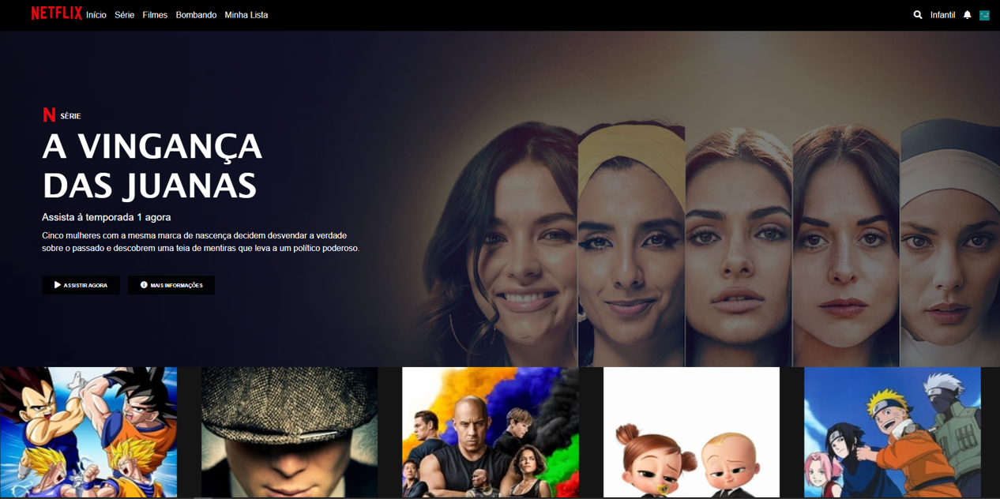

<h1 align="center">
    
</h1>
<h2 align="center"> 
	🚧  Projeto NetflixClone 🚧
</h2>

## 💻 Sobre o projeto

NetflixClone - é um projeto de estudo relacionado ao bootcamp da Dio, colocando em prática o aprendizado das aulas de HTM5/CSS3/JS e plugins do JQuery.

## Layout

## 🛠 Tecnologias

As seguintes ferramentas foram usadas na construção do projeto:

 
  
  
  
  
 

## Autor

---

<a href="https://github.com/osiasmiranda">
 
  
 <b>Osias Miranda</b></a> <a href="https://github.com/osiasmiranda" title="foguete">🚀</a>

Feito com ❤️ por Osias Miranda 👋🏽 Entre em contato!

